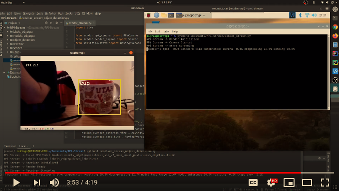

# Fast Raspberry Pi Stream Object Detection - Multi Platform
## Introduction
Live camera stream: from Raspberry Pi to your local computer host.
<br>Live object detection: with Coral EdgeTPU on host side.
<br>High FPS: 35-45, depending mostly on network condition.
<br>Multiple platform: ready for Ubuntu, MacOS, Windows.
<br>Application scenario: AI-powered surveillance camera.

## Video Tutorial
* [A preview of this project](https://www.youtube.com/watch?v=PCdNH4zSNug)
* [](https://www.youtube.com/watch?v=PCdNH4zSNug)
## Preparation and Environment
* Raspberry Pi, [latest RPi4](https://www.raspberrypi.org/products/raspberry-pi-4-model-b/) is recommended.
* Latest [Raspbian](https://www.raspberrypi.org/downloads/raspbian/) is recommended for RPi. 
* A camera for RPi, such as [RPi camera module V2](https://www.raspberrypi.org/products/camera-module-v2/).
* A local computer host with usb 3.0 port:
  * Ubuntu, MacOS, Windows are supported.
* [Coral EdgeTPU](https://coral.ai/products/accelerator/). USB version is recommended.
* Python virtual env is recommended:
  * virtualenv (python3.7) for RPi.
  * [Anaconda / Conda](https://www.anaconda.com/) (python3.7) for host.
* IDE such as [PyCharm](https://www.jetbrains.com/pycharm/) is recommended for host.
## Installation
Clone this repository on both RPi and computer host sides:
```
git clone https://github.com/redlogo/RPi-Stream.git
```
Install libs needed for Raspberry Pi:
```
bash RPi-requirements.sh
```
Install libs required for local computer with EdgeTPU unplugged:
```
# Ubuntu
bash computer-hose-requirements-linux.sh
# MacOS
bash computer-host-requirements-macos.sh
# Windows
check out computer-host-requirements-windows.txt
```
Plug USB EdgeTPU into the host usb 3.0 port.
## Usage
Edit on RPi side, change sender_stream.py:
```
# line 20, change it to your local computer host ip
target_ip = '192.168.7.33'  
```
Firstly execute script on RPi side:
```
python3 sender_stream.py
```
Secondly execute script on local computer host side:
```
python3 receiver_stream_object_detection.py
(Windows: try 'python' w/o '3' or use IDE instead of Windows CMD)
```
To exit, firstly terminate RPi side, then host side.
## Coding Style
General Python 3 Coding style.
## Version
1.0 - April 2020.
## Author
redlogo
## References and Acknowledgements
* [Coral EdgeTPU](https://coral.ai/)
* [Python library of imagezmq](https://github.com/jeffbass/imagezmq)
* [A brilliant project by EdjeElectronics](https://github.com/EdjeElectronics/TensorFlow-Lite-Object-Detection-on-Android-and-Raspberry-Pi)
## License
MIT
## Copyright
Copyright © 2020 redlogo